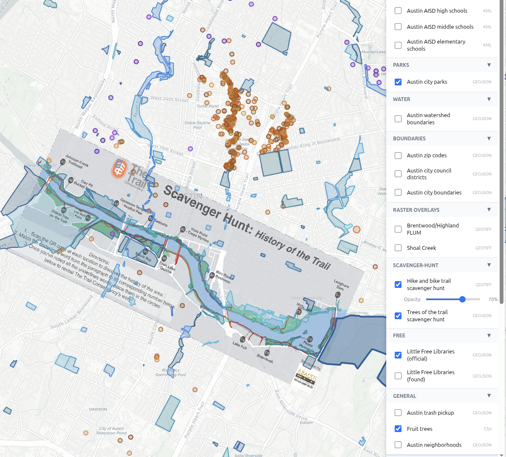

Overworld is a web app for viewing map data, including points, routes, regions, and raster overlays.

It supports a variety of geodata formats, with a preference for geojson.

It can render georeferenced tif files, which can easily be created at https://mapwarper.net/ (upload, rectify, export).

Data sources are defined with a simple json file. There is no capability to upload or edit data within the app.

# Alternatives
- google earth
- qgis
- https://github.com/qgis/qwc2-demo-app
- https://github.com/NASA-AMMOS/MMGIS

- https://docs.mapstore.geosolutionsgroup.com/en/latest/ - not sure if it supports general uploads
- https://terria.io/plans - expensive
- arcgis - expensive
- https://felt.com/ - no free export or import ($200/month)
- https://sepal.io/ - more focused on professional remote sensing?
- https://geonode.org/ - awaiting account approval
- https://mapcarta.com/ - don't see a data upload option?

https://old.reddit.com/r/gis/comments/zo7ee9/open_source_alternatives_to_arcgis_online/